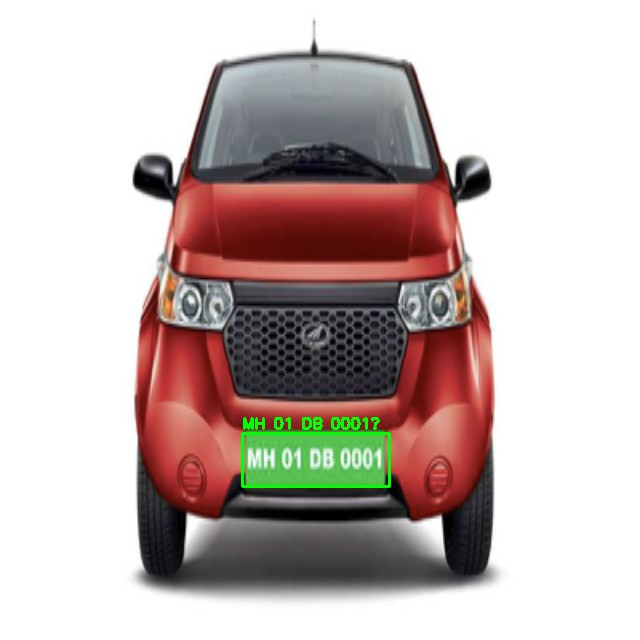

# Licence Plate Detection 

In this application, Car License Plate Number Extraction is done 

The ipython [notebook](./License_Plate_Extraction.ipynb) mentioned was divided into 5 sections

1. Dataset Preparation with respect to Yolo format
2. Object Detection Model Training (Retraining)
3. Object Detection Model Inference
4. Text Extraction using Tesseract
5. Show result on the whole image

### Dataset 
- Taken from kaggle [Link](https://www.kaggle.com/datasets/andrewmvd/car-plate-detection)

### Model Details
- Currently Yolov5 small is taken for training 
- The ultralytics yolov5 is being used

### Final Output 

The following image is output after the license extraction 

### To Do: 
- Implement easyOCR
- include video and threading